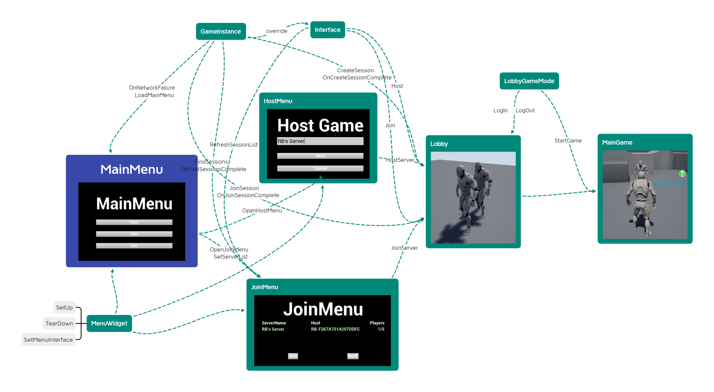

# 多人游戏

## 网络知识

### 多人游戏的类型

|                        | 同步性需求 | 会话长度     | 独立性 | 虚幻引擎支持性 |
| ---------------------- | ---------- | ------------ | ------ | -------------- |
| 回合制游戏             | 不需要     | 不定         | 强     | 中             |
| 基于会话的实时游戏     | 需要       | 较短   (<1h) | 中     | 强             |
| 大型多人在线和持久世界 | 需要       | 无限         | 弱     | 中             |

 

### 基于会话的三个 阶段

1. 发现：创建一个链接，告诉人们可以连接
2. 连接：使用房主的链接为服务器，等待玩家连接
3. 同步：开始游戏并同步

### 点对点模型

每次都等所有人完成，才会执行下一个任务。

可能有作弊行为。

### 客户端-服务器 模型

服务器统一下发玩家的状态，防止了作弊

### Tips：连接到mini网络

1. 找到你的IP地址
2. 启动服务器
3. 启动一些客户端 
4. 确保客户端连接到服务器

Command Prompt:

 "E:\UE_4.27\UE_4.27\Engine\Binaries\Win64\UE4Editor.exe" "F:\Unreal_Project\PuzzlePlatforms\PuzzlePlatforms.uproject" /Game/ThirdPersonCPP/Maps/ThirdPersonExampleMap?listen -server -log

"E:\UE_4.27\UE_4.27\Engine\Binaries\Win64\UE4Editor.exe" "F:\Unreal_Project\PuzzlePlatforms\PuzzlePlatforms.uproject"  -game -log

### mark一些操作

#### 仅在服务器执行

~~~cpp
if(HasAuthority())
{
    ...
}
~~~

#### 复制object && 复制移动

~~~c'p'p
	//服务器负责复制下发到客户端，不加if会在客户端也执行，此时可能报错
	if (HasAuthority()) {
		SetReplicates(true);//直观上来看物体的性质（材质，碰撞）被复制到客户端
		SetReplicateMovement(true);//物体的运动被复制到客户端
	}
~~~

#### 仅在客户端执行

~~~cpp
if(!HasAuthority())
{
    ...
}
~~~

现象：客户端表面上执行了操作，但是出现了其他问题。

原因：服务端要保证同步的正确性，客户端的现象不能改变服务端的同步下发，实际上还是根据服务端执行。

### NET模型

设备1 -> 局域网1 -> 互联网 <- 局域网2 <- 设备2

### Steam & Unreal

Steam

↑

Steamworks SDK 

↑

Online Sub-System  

↑

Unreal Engine

### 配置&测试

build.cs

~~~cpp
 OnlineSubsystem
~~~

DeaultEngine

~~~cpp
[OnlineSubsystem]
DefaultPlatformService=NULL
~~~

### 垃圾回收机制

UObject都在一个set里

unreal从 `root set`开始，遍历所有UProperty的指针

没找到的UObject被删除

### 配置Steam

打开插件 Online Subsystem Steam

build文件添加 "OnlineSubsystemSteam"

defaultEngine 添加

~~~cpp
[/Script/Engine.GameEngine]
+NetDriverDefinitions=(DefName="GameNetDriver",DriverClassName="OnlineSubsystemSteam.SteamNetDriver",DriverClassNameFallback="OnlineSubsystemUtils.IpNetDriver")

[OnlineSubsystem]
DefaultPlatformService=Steam

[OnlineSubsystemSteam]
bEnabled=true
SteamDevAppId=480

[/Script/OnlineSubsystemSteam.SteamNetDriver]
NetConnectionClassName="OnlineSubsystemSteam.SteamNetConnection"
~~~

## 整体思路

