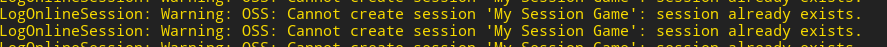

# 多人游戏

## 多人游戏的类型

|                        | 同步性需求 | 会话长度     | 独立性 | 虚幻引擎支持性 |
| ---------------------- | ---------- | ------------ | ------ | -------------- |
| 回合制游戏             | 不需要     | 不定         | 强     | 中             |
| 基于会话的实时游戏     | 需要       | 较短   (<1h) | 中     | 强             |
| 大型多人在线和持久世界 | 需要       | 无限         | 弱     | 中             |

 

## 基于会话的三个 阶段

1. 发现：创建一个链接，告诉人们可以连接
2. 连接：使用房主的链接为服务器，等待玩家连接
3. 同步：开始游戏并同步

## 点对点模型

每次都等所有人完成，才会执行下一个任务。

可能有作弊行为。

## 客户端-服务器 模型

服务器统一下发玩家的状态，防止了作弊

### Tips：连接到mini网络

1. 找到你的IP地址
2. 启动服务器
3. 启动一些客户端 
4. 确保客户端连接到服务器

Command Prompt:

 "E:\UE_4.27\UE_4.27\Engine\Binaries\Win64\UE4Editor.exe" "F:\Unreal_Project\PuzzlePlatforms\PuzzlePlatforms.uproject" /Game/ThirdPersonCPP/Maps/ThirdPersonExampleMap?listen -server -log

"E:\UE_4.27\UE_4.27\Engine\Binaries\Win64\UE4Editor.exe" "F:\Unreal_Project\PuzzlePlatforms\PuzzlePlatforms.uproject"  -game -log

## mark一些操作

### 仅在服务器执行

~~~cpp
if(HasAuthority())
{
    ...
}
~~~

## 复制object && 复制移动

~~~c'p'p
	//服务器负责复制下发到客户端，不加if会在客户端也执行，此时可能报错
	if (HasAuthority()) {
		SetReplicates(true);//直观上来看物体的性质（材质，碰撞）被复制到客户端
		SetReplicateMovement(true);//物体的运动被复制到客户端
	}
~~~

## 仅在客户端执行

~~~cpp
if(!HasAuthority())
{
    ...
}
~~~

现象：客户端表面上执行了操作，但是出现了其他问题。

原因：服务端要保证同步的正确性，客户端的现象不能改变服务端的同步下发，实际上还是根据服务端执行。

## NET模型

设备1 -> 局域网1 -> 互联网 <- 局域网2 <- 设备2

## Game Instance

游戏全局有且仅有一个的类

主要用于写跨关卡逻辑，控制台命令,MainMenu

~~~cpp
UFUNCTION(Exec)//控制台命令
void Host();
~~~

~~~cpp
void UPuzzlePlatformInstance::Host()
{
	UEngine*Engine = GetEngine();
	if(!ensure(Engine!=nullptr))return;
	Engine->AddOnScreenDebugMessage(0,2,FColor::Green,TEXT("Hosting"));
	UWorld*World = GetWorld();
	if (!ensure(World != nullptr))return;
	World->ServerTravel("/Game/ThirdPersonCPP/Maps/ThirdPersonExampleMap?listen");//将玩家控制器传送到某个地图,并监听
    //PlayerController->ClientTravel(Address,ETravelType::TRAVEL_Absolute);//将客户端传送到服务端地址的地图里
}
~~~

## 连接C++和UMG蓝图

c++类继承自UserWidget

~~~cpp
	UPROPERTY(meta = (BindWidget))
	class UButton* Host; 
~~~

##  

## Interface

interface 写纯虚函数

~~~c'p'p
virtual void Host() = 0;
~~~

另一个类继承自interface,并完成实现

~~~cpp
class PUZZLEPLATFORMS_API UPuzzlePlatformInstance : public UGameInstance,public IMenuInterface
{
	GENERATED_BODY()

public:

	UFUNCTION(Exec)//控制台命令
	void Host();
};
~~~

~~~cpp
Menu->SetMenuInterface(this);//让menu找到这个接口实现
~~~

Menu使用这个接口的类

~~~c'p'p
void SetMenuInterface(IMenuInterface* menuInterface);

IMenuInterface* MenuInterface;
~~~

~~~cpp
void UMainMenu::SetMenuInterface(IMenuInterface* menuInterface)
{
	MenuInterface = menuInterface;
}

void UMainMenu::HostServer()
{
	if (MenuInterface != nullptr)
	{
		MenuInterface->Host();
	}
}
~~~

## Error

~~~cpp
if (!ensure(Join != nullptr)) return false;
	Join->OnClicked.AddDynamic(this, &UMainMenu::OpenJoinMenu);
~~~

AddDynamic绑定的函数需要UFUNCTION()宏

~~~cpp
//Error
void OpenJoinMenu();
~~~

~~~cpp
//Right	
UFUNCTION()
	void OpenJoinMenu();
~~~

## Steam & Unreal

Steam

↑

Steamworks SDK 

↑

Online Sub-System  

↑

Unreal Engine

## 配置&测试

build.cs

~~~cpp
 OnlineSubsystem
~~~

DeaultEngine

~~~cpp
[OnlineSubsystem]
DefaultPlatformService=NULL
~~~

gameinstance

~~~cpp
#include "OnlineSubsystem.h"

void UPuzzlePlatformInstance::Init()
{
	IOnlineSubsystem* Subsystem = IOnlineSubsystem::Get();//寻找在线子系统
	if (Subsystem != nullptr)
	{
		UE_LOG(LogTemp, Warning, TEXT("Found %s Subsystem "), *Subsystem->GetSubsystemName().ToString());
		IOnlineSessionPtr SessionInterface = Subsystem->GetSessionInterface();//寻找会话接口
		if (SessionInterface.IsValid()) {
			UE_LOG(LogTemp, Warning, TEXT("Found  Session "));
		}
	}
}
~~~

## 实例计数

使用`TSharedPtr<AActor>`

递增计数

破坏时减少指针

## 垃圾回收机制

UObject都在一个set里

unreal从 `root set`开始，遍历所有UProperty的指针

没找到的UObject被删除

## 创建会话

- 思路：
  - 点击Host创建会话，通过essionName判断：
    - 如果已经创建过，调用DestroySession+CreateSession
    - 如果没创建过，调用CreateSession
  - 创建成功时调用OnCreateSessionComplete函数
  - 创建失败时调用OnDestroySessionComplete函数

- 销毁会话：如果不销毁会话，多次创建会产生冲突

~~~cpp
#include "OnlineSubsystem.h"

	IOnlineSessionPtr SessionInterface;

	void OnCreateSessionComplete(FName SessionName,bool Success);
	void OnDestroySessionComplete(FName SessionName,bool Success);
	void CreateSession();
~~~

~~~cpp
#include "Interfaces/OnlineSessionInterface.h"
#include "OnlineSessionSettings.h"

const static FName SESSION_NAME = TEXT("My Session Game");//Session Name

void UPuzzlePlatformInstance::Init()
{
	IOnlineSubsystem* Subsystem = IOnlineSubsystem::Get();
	if (Subsystem != nullptr)
	{
		UE_LOG(LogTemp, Warning, TEXT("Found %s Subsystem "), *Subsystem->GetSubsystemName().ToString());
		SessionInterface = Subsystem->GetSessionInterface();
		if (SessionInterface.IsValid()) {
			//UE_LOG(LogTemp, Warning, TEXT("Found  Session "));
            
            //在创建会话成功和销毁会话成功上分别绑定动态函数
			SessionInterface->OnCreateSessionCompleteDelegates.AddUObject(this,&UPuzzlePlatformInstance::OnCreateSessionComplete);
			SessionInterface->OnDestroySessionCompleteDelegates.AddUObject(this,&UPuzzlePlatformInstance::OnDestroySessionComplete);
		}
	}
}

void UPuzzlePlatformInstance::Host()
{
	auto ExistingSession = SessionInterface->GetNamedSession(SESSION_NAME);
	if (ExistingSession != nullptr) {
		SessionInterface->DestroySession(SESSION_NAME);
	}
	else {
		CreateSession();
	}
}
void UPuzzlePlatformInstance::OnCreateSessionComplete(FName SessionName, bool Success)
{
	if(!Success)return;
	if (Menu != nullptr) {
		Menu->TearDown();
	}
	UEngine*Engine = GetEngine();
	if (!ensure(Engine != nullptr))return;
	Engine->AddOnScreenDebugMessage(0, 2, FColor::Green, TEXT("Hosting"));
	UWorld*World = GetWorld();
	if (!ensure(World != nullptr))return;

	World->ServerTravel("/Game/ThirdPersonCPP/Maps/ThirdPersonExampleMap?listen");//将玩家控制器传送到某个地图,并监听
}

void UPuzzlePlatformInstance::OnDestroySessionComplete(FName SessionName, bool Success)
{
	if (Success) {
		CreateSession();
	}
}

void UPuzzlePlatformInstance::CreateSession()
{
	if (SessionInterface.IsValid()) {
		FOnlineSessionSettings SessionSettings;
		SessionInterface->CreateSession(0, SESSION_NAME, SessionSettings);//第0个玩家,创建会话
	}
}
~~~

## 寻找会话

~~~cpp
void UPuzzlePlatformInstance::Init()
{
SessionInterface->OnFindSessionsCompleteDelegates.AddUObject(this,&UPuzzlePlatformInstance::OnFindSessionsComplete);
	SessionSearch = MakeShareable(new FOnlineSessionSearch());
	if(SessionSearch.IsValid()) {
		SessionInterface->FindSessions(0,SessionSearch.ToSharedRef());
	}
}
void UPuzzlePlatformInstance::OnFindSessionsComplete(bool Success)
{
	UE_LOG(LogTemp,Warning,TEXT("Found Session"));
}
~~~

## 配置Steam

打开插件 Online Subsystem Steam

build文件添加 "OnlineSubsystemSteam"

defaultEngine 添加

~~~cpp
[/Script/Engine.GameEngine]
+NetDriverDefinitions=(DefName="GameNetDriver",DriverClassName="OnlineSubsystemSteam.SteamNetDriver",DriverClassNameFallback="OnlineSubsystemUtils.IpNetDriver")

[OnlineSubsystem]
DefaultPlatformService=Steam

[OnlineSubsystemSteam]
bEnabled=true
SteamDevAppId=480

[/Script/OnlineSubsystemSteam.SteamNetDriver]
NetConnectionClassName="OnlineSubsystemSteam.SteamNetConnection"
~~~

